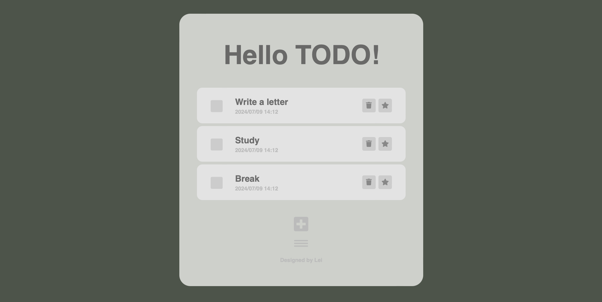

# React Todo App

Add todo tasks and check them off when they're done. 

You can also star important todos or delete them if they are not needed. Additionally, you can rename the 'Hello TODO!' title to anything you like. The menu bar below allows you to switch between different category views.

Page: https://r09521516.github.io/todo/

# Built with

- HTML + CSS + JavaScript
- React

# React + Vite

This template provides a minimal setup to get React working in Vite with HMR and some ESLint rules.

Currently, two official plugins are available:

- [@vitejs/plugin-react](https://github.com/vitejs/vite-plugin-react/blob/main/packages/plugin-react/README.md) uses [Babel](https://babeljs.io/) for Fast Refresh
- [@vitejs/plugin-react-swc](https://github.com/vitejs/vite-plugin-react-swc) uses [SWC](https://swc.rs/) for Fast Refresh

# Contact

- Email: leihsu97@gmail.com
- Project link: https://github.com/r09521516/todo

# Acknowledgments

- [Font Awesome](https://fontawesome.com/start)
